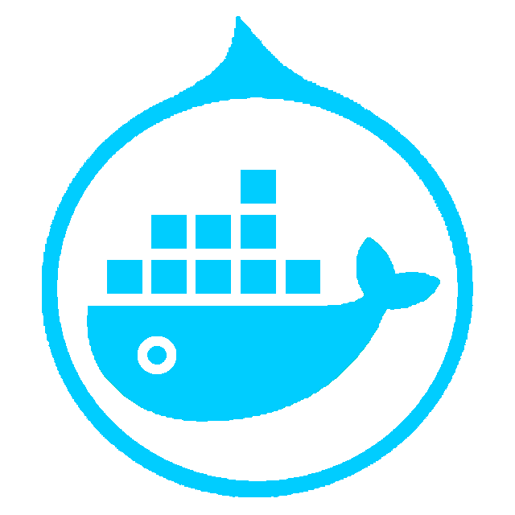

# Dockerian Pages

---

## GitHub Repositories

* [devtest](https://github.com/dockerian/devtest)  
  Automated Functional Tests for OpenStack Developer SDKs

* [go-coding](https://github.com/dockerian/go-coding)  
  Golang coding exercise

* [js-ui](https://github.com/dockerian/js-ui)  
  Prototype Web UI by JavaScript Frameworks

* [n0dejs-api](https://github.com/dockerian/n0dejs-api)  
  NodeJS with ES6/ECMAScript 2015

* [poetry](https://github.com/dockerian/poetry) | **[web](https://dockerian.github.io/poetry/)** <a href="https://dockerian.github.io/poetry/" style="text-decoration:none">github.io pages</a> 
  Chinese/English poetry collection, study notes, and tools.

* [pyapi](https://github.com/dockerian/pyapi)  
  RESTful API examples in python

* [pyml](https://github.com/dockerian/pyml)  
  Python Moonlight (Machine Learning) Practice

 

&raquo; <a href="https://github.com/dockerian">Dockerian</a> at GitHub &laquo;
